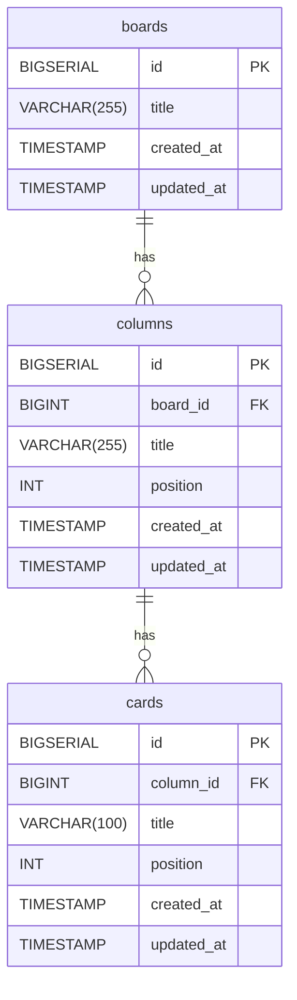

# DB設計

## ER図

---

## テーブル定義

### boards（ボード）

| カラム名 | データ型 | NULL | デフォルト | 説明 |
|---------|---------|------|-----------|------|
| id | BIGSERIAL | NOT NULL | 自動採番 | 主キー |
| title | VARCHAR(255) | NOT NULL | − | ボードのタイトル |
| created_at | TIMESTAMP | NOT NULL | CURRENT_TIMESTAMP | 作成日時 |
| updated_at | TIMESTAMP | NOT NULL | CURRENT_TIMESTAMP | 更新日時 |

### columns（カラム）

| カラム名 | データ型 | NULL | デフォルト | 説明 |
|---------|---------|------|-----------|------|
| id | BIGSERIAL | NOT NULL | 自動採番 | 主キー |
| board_id | BIGINT | NOT NULL | − | 外部キー（boards.id） |
| title | VARCHAR(255) | NOT NULL | − | カラムのタイトル |
| position | INT | NOT NULL | − | カラムの表示順（昇順） |
| created_at | TIMESTAMP | NOT NULL | CURRENT_TIMESTAMP | 作成日時 |
| updated_at | TIMESTAMP | NOT NULL | CURRENT_TIMESTAMP | 更新日時 |

### cards（カード）

| カラム名 | データ型 | NULL | デフォルト | 説明 |
|---------|---------|------|-----------|------|
| id | BIGSERIAL | NOT NULL | 自動採番 | 主キー |
| column_id | BIGINT | NOT NULL | − | 外部キー（columns.id） |
| title | VARCHAR(100) | NOT NULL | − | カードのタイトル |
| position | INT | NOT NULL | − | カラム内の表示順（昇順） |
| created_at | TIMESTAMP | NOT NULL | CURRENT_TIMESTAMP | 作成日時 |
| updated_at | TIMESTAMP | NOT NULL | CURRENT_TIMESTAMP | 更新日時 |
